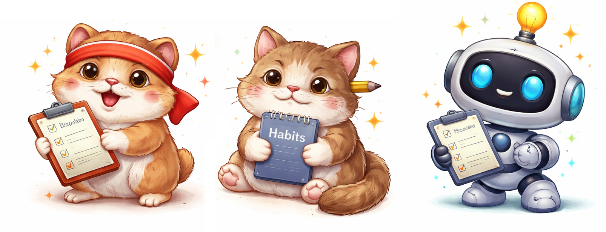

<div style="text-align: center;">

</div>

# 🧠 Habit Tracker — Product & Development Plan

Мы разрабатываем не просто трекер привычек, а систему, которая помогает пользователю формировать устойчивое поведение через аналитику, геймификацию и обратную связь.

Ключевая идея:

> вместо “напоминаний” — осознанное понимание своих привычек


## Roadmap разработки

### 🟢 Этап 1 — MVP (рабочий продукт)

На этом этапе мы делаем полностью рабочее приложение, но без усложнений.

Пользовательский сценарий уже должен работать от начала до конца:
- пользователь регистрируется
- добавляет привычку
- отмечает выполнение
- видит прогресс

**Авторизация.** Простая система:
- регистрация / логин
- хранение пользователя в БД
- сессии через backend

**Привычки.** Пользователь может:
- создать привычку (название, частота, теги)
- видеть список привычек
- редактировать и удалять

**Трекинг.**
- отметка выполнения
- хранение истории
- учет времени (в минутах)

**Базовая аналитика.** На этом этапе без “AI” — только логика:
- процент выполнения
- streak (серии)
- график активности
- heatmap по дням

**UI.** Интерфейс делаем сразу аккуратным:
- dashboard с привычками
- экран привычки (история + календарь)
- базовые графики


### 🟢 Этап 2 — Умная аналитика (без ML)

Здесь проект начинает “думать”, но без тяжелого AI.

Мы используем:
- группировки
- агрегации
- правила

**Анализ поведения.** Приложение начинает давать инсайты:
- “Ты чаще выполняешь привычки утром”
- “Воскресенье — самый слабый день”
- “Спортивные привычки выполняются лучше”

**Система тегов.** Теги становятся основой аналитики.

Структура:
- категория → подкатегория → тег

Пример:
- здоровье → физическое → кардио
- обучение → чтение

**Учет времени.** Каждое выполнение хранит:
- дату
- длительность

Это позволяет:
- считать общее время
- анализировать распределение активности


### 🟢 Этап 3 — Геймификация

На этом этапе приложение становится “живым”.

**XP и уровни**
- пользователь получает XP за действия
- уровень растет со временем

**Достижения**

Примеры:
- 7 дней подряд
- 10 часов активности
- 100 выполнений

Челленджи
- “5 тренировок за неделю”
- “7 дней без пропусков”


### 🟢 Этап 4 — Генератор привычек

Вместо AI используем опросник + правила.

**Пользователь отвечает:**
- цель (здоровье / обучение / продуктивность)
- доступное время
- уровень

**Система генерирует:**
- список привычек
- постепенный план внедрения

**Маскот системы.** Один из ключевых элементов продукта.

Маскот — это интерфейс общения с пользователем:
- дает фидбек
- мотивирует
- реагирует на поведение




**Примеры поведения**

Если пользователь активен:
- “🔥 Ты на серии! Отличная работа!”

Если пропускает:
- “Я скучаю… давай сделаем хотя бы маленький шаг”

**Связь с геймификацией**
- маскот “растет” вместе с пользователем
- открываются новые эмоции
- визуальные изменения


### 🎯 Финальный результат

- полноценное приложение с UI
- система аналитики привычек
- геймификация
- генератор привычек
- маскот как уникальная фича

💡 
- не перегружен “AI ради AI”
- объяснимый и логичный
- легко расширяется


## Архитектура проекта

```
/app
  /api            # FastAPI endpoints
  /ui             # NiceGUI интерфейс
  /models         # ORM модели
  /services       # бизнес-логика
  /analytics      # аналитика привычек
  /gamification   # XP, уровни, достижения
  /core           # настройки, auth, utils
```


## Технологический стек

**Backend**  
- FastAPI — основной API
- SQLAlchemy — работа с БД
- Pydantic — валидация

**Frontend (UI)**  
- NiceGUI — основной UI-фреймворк ?

**Database**  
- PostgreSQL

**Аналитика**  
- pandas
- numpy


## Команда

- Казанцев Данила
- Ходченков Артем
- Мандзулашвили Гогита
- Василинич Андрей
- Друхольский Александр
- Козлова Анна